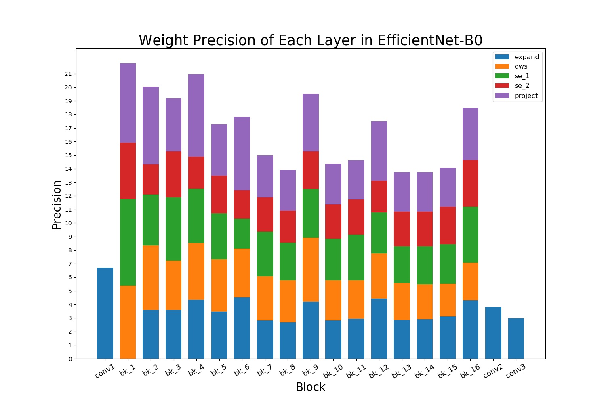
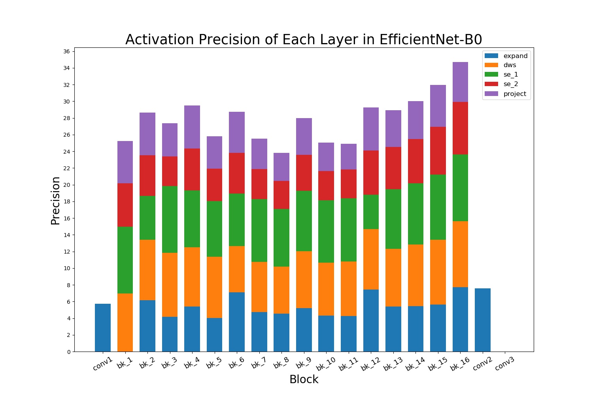

# Adjustable Quantization for MicroNet Challenge

### This is the submission for MicroNet Challenge hosted at NIPS 2019.

### Team
***Texas-EIC***: Yonggan Fu, Ruiyang Zhao, Yue Wang, Chaojian Li, Haoran You, Zhangyang Wang, Yingyan Lin

### Solution
Our method is called **Adjustable Quantization**, a finegrained mix-precision quantization scheme which is extremely fast to reach convergence started from a pretrained float32 model.

Metric: 0.183060 @ 75.092% Top 1 accuracy on ImageNet

### Main Idea: Adjustable Quantization Range + Adjustable Precision
To enable a finegrained mix-precision quantization on a light-weight model, we aim at refining the traditional quantization to be more adjustable according to the efficiency limitation. Based on the previous [Quantization Aware Training](https://arxiv.org/abs/1712.05877), we introduce channel-wise trainable scale factors for both quantization range and precision. To eliminate the effect of the [outliners](https://arxiv.org/abs/1803.08607), we introduce a trainable scale factor ***alpha*** for each channel to make the quantization range tp adjust itself during the quantization process (similar ideas can be found [here](http://openaccess.thecvf.com/content_CVPRW_2019/papers/Low-Power%20Image%20Recognition%20Challenge/Goncharenko_Winning_Solution_on_LPIRC-ll_Competition_CVPRW_2019_paper.pdf)). In addition, to further explore the compression potential, we give a channel-wise scale factor ***beta*** to the quantization precision so that each channel in different layers can learn to adjust its precision. Since number of parameters and FLOPS are all related with the channel precision settings, we explicitly introduce the #Params and #Flops into the loss function, controlling the trade-off between accuracy and efficiency. The quantization parameter in the [QAT paper](https://arxiv.org/abs/1712.05877) can be rewritten as ([ ] means rounding operation):

<div align="center">

</div>

We choose [EfficientNet-B0](https://arxiv.org/abs/1905.11946), a light-weight neural network generated by Neural Network Search. We apply our Adjustable Quantization (both adjustable quantization range and adjustable precision) on all the weights in the network, and the input activations (feature maps) of all the convolutional layers (including regular convolution and depthwise convolution). And for the bias (actually BN fused into convolution) and the input activations of all the swish operation, i.e. *x\*sigmoid(x)* which is the activation function in EfficientNet-B0, we use fixed precision (8-bit) and adjustable quantization range. Therefore, all the weights and activations in EfficientNet-B0 are quantized to an integer while maintaining the potential of high accuracy. 

We introduce [Knowledge Distillation](https://arxiv.org/abs/1503.02531) and SWA ([Stochastic Weight Average](https://arxiv.org/abs/1904.11943)) in the training process for fast convergence. Our loss function contains 3 parts: classification loss, knowledge distillation loss which is the MSE between the output of the original float32 EfficientNet-B0 and the output of quantized EfficientNet-B0, the metric loss for controlling the trade-off between accuracy and model size(#Params and #Flops). To achieve a better convergence, we also apply an iterative training strategy, i.e. dividing every 1/10 epoch into a mini-epoch and only training with Adjustable Precision in 1 mini-epoch every 2 mini-epochs (fixed the precision in the other mini-epoch). This training scheme slows down the descent speed of the metric and helps maintain the accuracy during training process. After iterative training, we start from a checkpoint with low metric and accuracy about 74.5%, fix the precision and finetune 1 more epoch with SWA, which will improve the accuracy by 0.5%.

To enable a better initialization of EfficientNet-B0 before applying Adjustable Quantization, we first conduct tensorflow official Quantization Aware Training (QAT) to get the initial weights and initial quantization range. To be more specific, we implement EfficientNet-B0 structure in tensorflow [Slim](https://github.com/tensorflow/models/tree/master/research/slim) training package which has good support for QAT. Since the [official pretrained checkpoint](https://github.com/tensorflow/tpu/tree/master/models/official/efficientnet) of EfficientNet-B0 provided by the author uses TPU API, we write a script to convert the official pretrained checkpoint into our Slim-based model's checkpoint so that we can enable QAT directly within the Slim framework. After several epochs QAT, we can use the weight and quantization range of the final model as the initialization for further Adjustable Quantization. 

### Result
It's easy to control the trade-off between accuracy and efficiency in our method. For the model exactly satisfying the 75% Top 1 accuracy requirement, we averagely use 3.04 bits and 5.07 bits to represent weights and activations, which is a extremely compact model with metric 0.183060 @ 75.092% Top 1 accuracy.

Here's the distribution of the average precision of weights and activations in each layer of EfficientNet-B0 after Adjustable Quantization. 


### File Utilization
**slim** : self-customized Slim training package based on [Slim](https://github.com/tensorflow/models/tree/master/research/slim), which is used to generate pretrained float32 EfficientNet-B0 and quantized EfficientNet-B0 base on QAT

**pretrained** : pretrained float32 Slim-based EfficientNet-B0, and EfficientNet-B0 after Quantization Aware Training

**adj_quant** : root directory containing all the source codes of Adjustable Quantization

**adj_quant/logs** : tensorboard information collected during training

**adj_quant/weights** : checkpoints saved during training

**adj_quant/best_ckpt** : contain the current best checkpoint

**adj_quant/initial_thresholds.json** : the intial min/max quantization range of the each channel in weights and activations 

**adj_quant/model_info.json** : the Params/Flops of each layer in EfficientNet-B0

**adj_quant/data.py** : read training/validation images in tfrecord format

**adj_quant/imagenet.py** : necessary functions for reading ImageNet

**adj_quant/dataset_utils.py** : necessary function for reading ImageNet

**adj_quant/prepare_weights.py** : extract the weights from a pretrained Slim-based model to a pickle file as the initialization of Adjustable Quantization

**adj_quant/train.py** : train EfficientNet-B0 with Adjustable Quantization

**adj_quant/eval.py** : evaluate the accuracy and metric a saved checkpoint file

**adj_quant/scripts/effnetb0** : build model with Adjustable Quantization Nodes

**adj_quant/scripts/trainer** : training strategy and evaluation strategy

**adj_quant/scripts/thresholds.py** : fetch initial quantization range

### How to evaluate the accuracy and metric
To know the usage of command line parameters, please use:
```
python train.py --help
```
or
```
python eval.py --help
```

#### Environment
Tensorflow-gpu 1.13.1, CUDA 10.0, python 3.6.0, tqdm 4.32.2

#### Evaluation
To check the accuracy and metric of the provided checkpoint, use the following commands:
```
python eval.py --weight_bits 8 \
               --act_bits 8 \
               --swish_bits 8 \
               --bias_bits 8 \
               --batch_size 50 \
               --bits_trainable \
               --ckpt_path best_ckpt/ckpt_metric_0.183060 \
               --dataset path_to_imagenet_tfrecord
```
***weight_bits*** and ***act_bits*** are the initial precision of the channels in each layer, and it will be multiplied with a channel-wise trainable scale factor saved in the checkpoint file and rounded to a integer to be the final precision of each channel in each layer. ***swish_bits*** is the precision for the input activation of swish operation and ***bias_bits*** is the precision for bias, which is actually the BatchNormalization layer fused into convolution. ***bits_trainable*** is used to enable Adjustable Precision. ***ckpt_path*** specifies the checkpoint file to be evaluated and you also need to specify the path to ImageNet dataset in tfrecord format. 

After correctly executing **eval.py**, you will get the accuracy, metric, #Params and #Flops shown in your command line. In addition, it will generate a new file named **quant_info.json**, containing the precision of each channel in all the weights and activations. You can recompute the metric according to this file.

#### Training
We provided the pretrained float32 EfficientNet-B0 checkpoint and the quantized EfficientNet-B0 checkpoint after QAT in *.pickle* format in the **pretrained** directory and the initial quantization range in **initial_thresholds.json**. You can directly utilize them as the initialization of Ajustable Quantization in a fast train mode or you can generate them step by step.

##### Fast Train Mode
All the prerequired files are all ready, you can start training with Adjustable Quantization directly:
```
python train.py --weight_bits 8 \
                --act_bits 8 \
                --swish_bits 8 \
                --bias_bits 8 \
                --lr_fixed \
                --lr 3e-6 \
                --lr_bits 1e-3 \
                --alpha 7 \
                --beta 85 \
                --gamma 0.7 \
                --max_epoch 3 \
                --batch_size 25 \
                --bits_trainable \
                --iter_train \
                --dataset path_to_imagenet_tfrecord
```
***lr_fixed*** denotes using fixed learning rate and ***lr*** is learning rate for weights and quantization range, ***lr_bits*** is the learning rate for precision. ***alpha*** and ***beta*** are the relative weight of classification loss and metric loss. ***gamma*** is to control the gradient backward of Flops. ***max_epoch*** is the total epochs of training. ***iter_train*** enables our training strategy, i.e. enabling Adjustable Precision for 1 mini-epoch every 2 mini-epochs and fixing the precision in the other mini-epoch. The other parameters have the same usage as mentioned above.

After training with the above settings, some checkpoints with good accuracy-efficiency trade-off can be acquired, but it's still not their best performance due to the complex multi-objective optimization. We can start from the best checkpoint, set ***beta*** to be 115 and run the above training process again for a lower metric. After that, we select some new checkpoints with accuracy lower than 75% (around 74%) and fix its precision for finetuning 1 more epoch with [SWA](https://arxiv.org/abs/1904.11943). In this process, the metric will be fixed while the accuracy can be improved by 0.5%.
```
python train.py --weight_bits 8 \
                --act_bits 8 \
                --swish_bits 8 \
                --bias_bits 8 \
                --lr_fixed \
                --lr 3e-6 \
                --lr_bits 1e-3 \
                --alpha 25 \
                --beta 0 \
                --gamma 0.7 \
                --max_epoch 1 \
                --swa_delay 0.2 \
                --swa_freq 0.1 \
                --batch_size 25 \
                --bits_trainable \
                --finetune \
                --dataset path_to_imagenet_tfrecord \
                --ckpt_path path_to_your_ckpt
```
***swa_delay*** specifies the delay from the beginning of the training procsess to the first time of recording weights. ***swa_freq*** is the frequency to record weights. ***fine_tune*** enables the finetune mode which fixing the precision and metric.

During finetung, we increase ***alpha*** to enable the model to focus more on classification error. To achieve better results, we repeat the above finetuning process 3 times from the generated SWA model with gradually lower learning rate. Finally we can achieve the best metric which satisfies the 75% accuracy requirement.

##### Generate prerequired files step by step 
If you want to generate the checkpoint files in pickle format in **pretrained** directory and **initial_thresholds.json** by yourself, you can follow the instructions here. We first convert the official EfficientNet-B0 checkpoint to our Slim-based version and then conduct the Quantization Aware Training to get the weight and threshold as initialization for Adjustable Quantization. To know more details about tensorflow-Slim usage, please refer to their official [github](https://github.com/tensorflow/models/tree/master/research/slim).

First, to generate the self-implemented EfficientNet-B0 checkpoint, you need to run:
```
cd slim
python train_image_classifier.py \
   --train_dir=logs \
   --train_image_size=192 \
   --model_name=efficientnet_b0 \
   --dataset_name=imagenet \
   --dataset_split_name=train \
   --preprocessing_name=efficientnet_b0 \
   --label_smoothing=0.1 \
   --moving_average_decay=0.9999 \
   --batch_size=80 \
   --learning_rate_decay_type=fixed \
   --learning_rate=1e-4 \
   --learning_rate_decay_factor=0.98 \
   --num_epochs_per_decay=2.5 \
   --num_clones=1 \
   --num_readers=8 \
   --num_preprocessing_threads=8 \
   --ignore_missing_vars=True  \
   --dataset_dir=path_to_imagenet_tfrecord 
```
you don't need to care about the accurac and once you get the initial checkpoint, you can stop the training process. Then you can run the converter to convert the offcial checkpoints to Slim-based version:
'''
python ckpt_assigner.py src_ckpt dest_ckpt
'''
***src_ckpt*** is the official checkpoint downloaded [here](https://github.com/tensorflow/tpu/tree/master/models/official/efficientnet) and ***dest_ckpt*** is the Slim-based checkpoint. The converted checkpoint has 76.93% Top 1 accuracy on ImageNet.

Then you can start tensorflow official Quantization Aware Training:
```
cd slim
python train_image_classifier.py \
   --train_dir=logs \
   --train_image_size=192 \
   --model_name=efficientnet_b0 \
   --dataset_name=imagenet \
   --dataset_split_name=train \
   --preprocessing_name="efficientnet_b0" \
   --label_smoothing=0.1 \
   --moving_average_decay=0.9999 \
   --batch_size=32 \
   --learning_rate_decay_type=fixed \
   --learning_rate=1e-4 \
   --learning_rate_decay_factor=0.98 \
   --num_epochs_per_decay=2.5 \
   --num_clones=1 \
   --num_readers=32 \
   --num_preprocessing_threads=32 \
   --ignore_missing_vars=True \
   --quantize_delay=0 \
   --allow_growth=False \
   --checkpoint_path=path_to_float32_ckpt \
   --dataset_dir=path_to_imagenet_tfrecord 
```
***quant_delay*** is used to start Quantization Aware Training with 8-bit weight and 8-bit activation. After several epoches, we can get a checkpoint with about 74.8% Top 1 accuracy.

Since the model with Adjustable Quantization utilizes pickle format file for both weight initialization and float32 teacher model (for knowledge distillation), we need to convert the float32 checkpoint and quantized checkpoint into pickle format. We first freeze our model to *.pb* file and then extract the weights to a *.pickle* file.

For float32 model, freeze the checkpoint to a *.pb* file:
```
cd slim
python export_inference_graph.py \
  --alsologtostderr \
  --model_name=efficientnet_b0 \
  --image_size=224 \
  --output_file=../adj_quant/pretrained/efficient_b0_autoaugment/efficientnet_b0.pb
python freeze_graph.py \
  --input_graph=../pretrained/efficient_b0_autoaugment/efficientnet_b0.pb \
  --input_checkpoint=path_to_float32_ckpt \
  --input_binary=true \
  --output_graph=../pretrained/efficient_b0_autoaugment/frozen_efficientnet_b0.pb \
  --output_node_names=efficientnet_b0/Predictions/Reshape_1
```

For quantized model, freeze the checkpoint to a *.pb* file:
```
cd slim
python export_inference_graph.py \
  --quantize \
  --alsologtostderr \
  --model_name=efficientnet_b0 \
  --image_size=224 \
  --output_file=../pretrained/efficient_b0_autoaugment_quant/efficientnet_b0_quant.pb
python freeze_graph.py \
  --input_graph=../pretrained/efficient_b0_autoaugment_quant/efficientnet_b0_quant.pb \
  --input_checkpoint=path_to_quantized_ckpt \
  --input_binary=true \
  --output_graph=../pretrained/efficient_b0_autoaugment_quant/frozen_efficientnet_b0_quant.pb \
  --output_node_names=efficientnet_b0/Predictions/Reshape_1
```

To convert the *.pb* file into *.pickle* format, you can use the following script and command:
```
cd adj_quant
python prepare_weights.py ../pretrained/efficient_b0_autoaugment/frozen_efficientnet_b0.pb
python prepare_weights.py ../pretrained/efficient_b0_autoaugment_quant/frozen_efficientnet_b0_quant.pb
```
Then the *.pickle* checkpoint will be generated in the same directory with *.pb* checkpoint.

If you want to regenerate the initial quantization range based on the new initialization, you can add `-e` or `--eval_initial_thresholds` command when executing the **train.py**.

To generate the **model_info.json** file which contains the #Params and #Flops of each layer in EfficientNet-B0, you can use the following command:
```
cd slim
python nets/mobilenet/efficientnet_b0.py
```

### Contact
If you have any question about the details of our work or seek for future cooperation, please contact [yf22@rice.edu](yf22@rice.edu).
